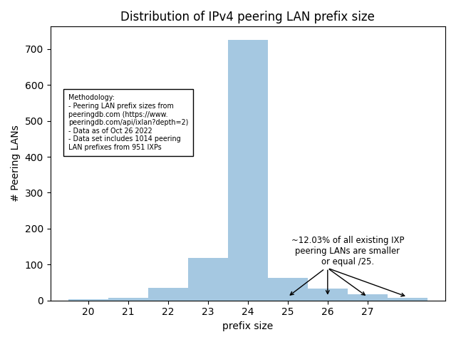
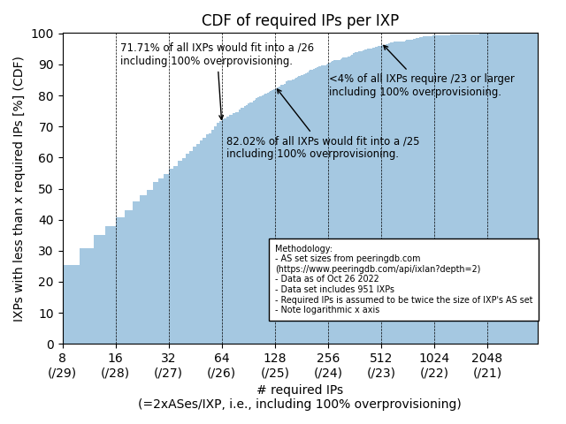

Methodology
-----------

- AS set sizes per IXP and peering LAN prefix sizes from peeringdb.com (https://www.peeringdb.com/api/ixlan?depth=2)
- Data as of June 3rd 2019 and Oct 26th 2022
- Data set includes 672/951 (2019/2022) IXPs and information on 726/1014 (2019/2022) peering LANs 
- Required IPs per IXP are assumed to be twice the size of IXP's AS set (i.e., 100% overprovisioning)
- Analysis can be reproduced by running the analysis.py script in this git project. To pull in more recent data from
peeringdb you can delete data.json and rerun the script.

Distribution of peering LAN sizes
---------------------------------

This analysis shows the distribution of current peering LAN prefix sizes.



(Figure 1)

<!---
Corresponding data:

```
+---------------+------------------+----------------------+----------------------+--------------------------+
| Prefix size   |   # Peering LANs |   # Peering LANs cum | # Peering LANs rel   | # Peering LANs rel cum   |
|---------------+------------------+----------------------+----------------------+--------------------------|
| /19           |                1 |                    1 | 0.10%                | 0.10%                    |
| /20           |                4 |                    5 | 0.39%                | 0.49%                    |
| /21           |                8 |                   13 | 0.79%                | 1.28%                    |
| /22           |               35 |                   48 | 3.45%                | 4.73%                    |
| /23           |              118 |                  166 | 11.64%               | 16.37%                   |
| /24           |              726 |                  892 | 71.60%               | 87.97%                   |
| /25           |               63 |                  955 | 6.21%                | 94.18%                   |
| /26           |               34 |                  989 | 3.35%                | 97.53%                   |
| /27           |               17 |                 1006 | 1.68%                | 99.21%                   |
| /28           |                8 |                 1014 | 0.79%                | 100.00%                  |
+---------------+------------------+----------------------+----------------------+--------------------------+
(Table 1)
```
-->

Theoretical minimum peering LAN size/IXP
-----------------------------------------

This analysis shows which fraction of IXPs in peeringDB would theoretically fit into a /27, /26, ..., /21. It is based
on the assumption that an IXP operator requires 2 times the number of connected ASes IPs to operate a peering LAN.



(Figure 2)

<!---
```
+------------------+--------------------+----------+--------------+------------+----------------+
| # req. IPs/IXP   | min. prefix size   |   # IXPs |   # IXPs cum | IXPs rel   | IXPs rel cum   |
|------------------+--------------------+----------+--------------+------------+----------------|
| <32              | </27               |      522 |          522 | 54.89%     | 54.89%         |
| 64               | /26                |      160 |          682 | 16.82%     | 71.71%         |
| 128              | /25                |       98 |          780 | 10.30%     | 82.02%         |
| 256              | /24                |       79 |          859 | 8.31%      | 90.33%         |
| 512              | /23                |       55 |          914 | 5.78%      | 96.11%         |
| 1024             | /22                |       32 |          946 | 3.36%      | 99.47%         |
| >=2048           | >=/21              |        5 |          951 | 0.53%      | 100.00%        |
+------------------+--------------------+----------+--------------+------------+----------------+
(Table 2)
```
-->

Implications on lower bound of allocation
-----------------------------------------

Roughly 82% (down from 83% in 2019) of all IXPs would theoretically fit into a /25 (Figure 2). This already includes 100% overprovisioning, i.e., 
2xconnected ASes/IXP. At the same time, 72% (down from 74% in 2019) of all peering LANs are /24s (Figure 1). Consequently, the default policy 
of assigning /24s has created large amounts of unused space.

Already today, more than 12% (up from 10% in 2019) of the peering LANs are operated with a network smaller or equal a /25. Having small 
peering LANs is not entirely unusual.

Implications on upper bound of allocation
-----------------------------------------

Large IXPs requiring a /23 or larger are very rare (<4%) (Figure 2). Thus, lowering the upper bound for assignments 
will not save large amounts of space. Large allocations should still be possible but should be thoroughly checked by 
RIPE. Due to the small number of large IXPs, the workload will obviously not be high for RIPE (Figure 1/2).
